# よりそい PHR　使い方ガイド

**骨形成不全症（指定難病274）の方向け**

> このガイドに表示されているデータは「見本」です。実際に使うと、あなた自身の記録が表示されます。

---

## よりそい PHR とは？

骨形成不全症（OI）と生きていく中で大切な記録を、スマホ一台でまとめておけるアプリです。

- 骨折・手術・入院の記録を年表にできる
- 今飲んでいるお薬をメモできる
- 今日の痛みや体の状態を残せる
- 骨代謝マーカーや骨密度の数値をグラフで見られる
- 診察室で医師に「見せる」画面がある
- 救急や麻酔のとき「あんしんカード」を見せられる

**毎日書かなくて大丈夫です。** 病院に行く前や、調子の悪い日だけ開いても使えます。

---

## 目次

1. [はじめての設定](#1-はじめての設定)
2. [ホーム画面](#2-ホーム画面)
3. [きろくする](#3-きろくする)
4. [ふりかえる](#4-ふりかえる)
5. [みせる（診察室で使う）](#5-みせる診察室で使う)
6. [あんしんカード](#6-あんしんカード)
7. [その他の機能](#7-その他の機能)
   - [治療タイムライン](#71-治療タイムライン)
   - [おくすり管理](#72-おくすり管理)
   - [症状きろく（くわしい記録）](#73-症状きろくくわしい記録)
   - [検査値きろく](#74-検査値きろく)
   - [患者会・支援情報](#75-患者会支援情報)

---

## 1. はじめての設定

**最初に1回だけ行います。**

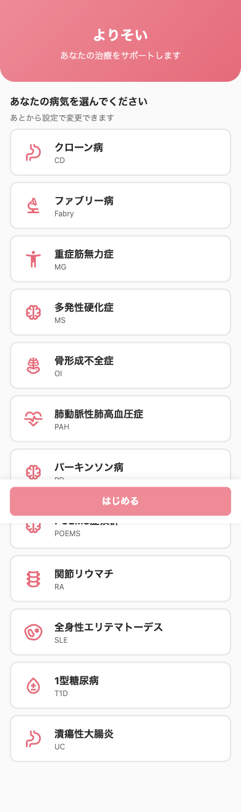

### 操作手順

1. アプリを開くと「病気を選んでください」という画面が出ます
2. **「骨形成不全症」** をタップして選びます（青い枠がつきます）
3. **「はじめる」** ボタンを押したら設定完了です

これでホーム画面に進みます。次回からはこの設定画面は出ません。

> 病気の種類はあとから「その他 → 病気・設定を変える」で変えられます。

---

## 2. ホーム画面

**アプリを開くと最初に出る画面です。**

| 画面（モーダルあり） | 画面（ホーム） |
|---|---|
| 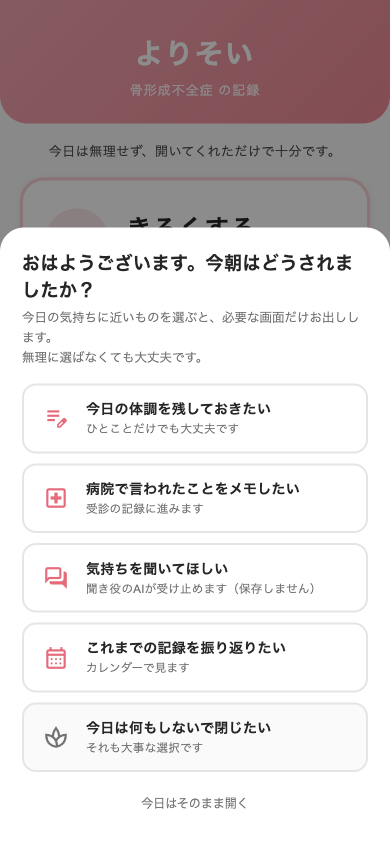 | 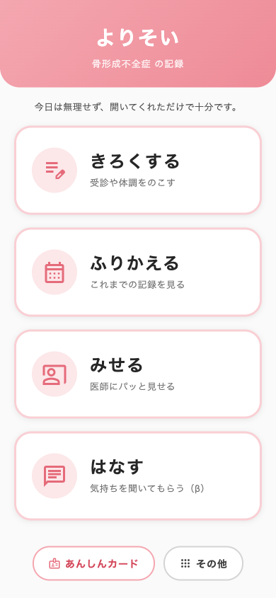 |

### 「今日はどうしましたか？」モーダルについて

初めて開いたときや、数日ぶりに開いたときに出てきます。

- 今日やりたいことに近いものを選ぶと、その画面に進みます
- **「今日はそのまま開く」** を押してもホームに進めます
- 無理に選ばなくて大丈夫です

### ホームの4つのボタン

| ボタン | 何ができる？ |
|--------|-------------|
| **きろくする** | 今日の体調や受診をメモする |
| **ふりかえる** | 過去の記録をカレンダーで見る |
| **みせる** | 診察室で医師に画面を見せる |
| **はなす** | 気持ちをAIに聞いてもらう（β版） |

画面下の「あんしんカード」「その他」は常に使えます。

---

## 3. きろくする

**診察後や、今日の体の様子を残しておきたいときに使います。**

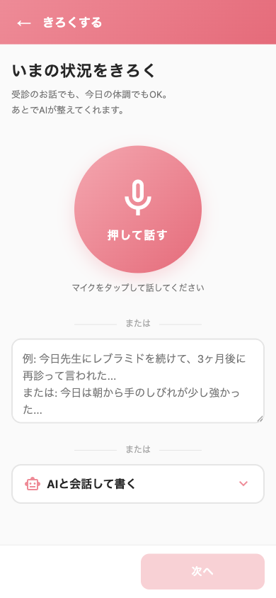

### 3つの記録方法

| 方法 | 説明 |
|------|------|
| **声で話す（音声入力）** | 丸いマイクボタンを押して話しかける。文字に変換してくれます |
| **文字で入力** | 自由にテキストで入力できます |
| **AIと一緒にまとめる** | 「AIと整理する」を選ぶと、会話形式で記録を整えてくれます |

### こんなことを記録できます

- 受診したこと（「今日整形外科に行った」）
- 骨折やケガがあったこと
- 先生から言われたこと・新しい薬のこと
- 今日の痛みや体の状態

> **ポイント：** 完璧に書こうとしなくて大丈夫です。「今日足が痛かった」の一言でも立派な記録になります。

---

## 4. ふりかえる

**過去に書いた記録をカレンダーで見られます。**

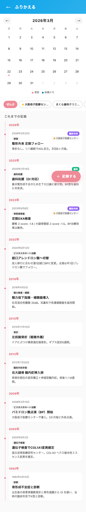

### 使い方

1. 「ふりかえる」ボタンを押す
2. カレンダーが表示されます。記録がある日には印がつきます
3. 日付を選ぶと、その日の記録が読めます

### こんな時に役立ちます

- 「あの骨折はいつだったっけ？」を調べるとき
- 次の診察前に「最近どうだったか」を確認するとき
- 痛みが続いているのか、良くなっているのか比べるとき

---

## 5. みせる（診察室で使う）

**診察室で医師に、今の状態をパッと見せるための画面です。**

| みせる画面 | 診察用サマリー |
|---|---|
| 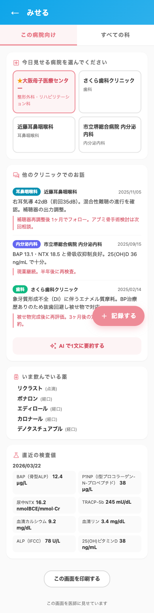 | 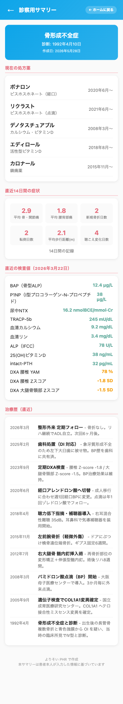 |

### 特徴

- 薬・症状・治療歴を **1画面に集約** して見せられます
- **口頭で説明しなくてもよい** ので、短い診察時間でも伝わります
- OIは整形外科・内分泌科・耳鼻科など複数科を受診する方が多いです。どの科でも同じ情報をすぐ見せられます

### 使い方

1. 診察室に入る前に「みせる」を開く
2. 見せたい内容のタブを選ぶ
3. そのままスマホの画面を医師に向ける

> **受診前チェック：** 「みせる」の画面を診察前に自分で確認しておくと、伝え忘れが防げます。

---

## 6. あんしんカード

**救急や麻酔が必要なとき、医療スタッフに見せる情報カードです。**

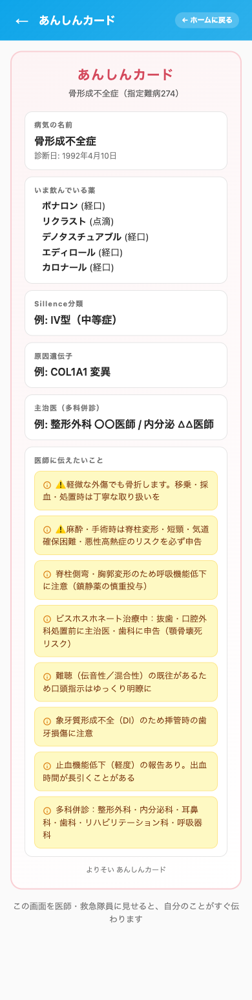

### 何が書いてある？

- 病名（骨形成不全症・指定難病274）
- Sillence分類（病気の型）と原因遺伝子
- 主治医の名前（複数科に対応）
- **医療スタッフへの注意事項**（あらかじめ設定されています）

### あんしんカードに記載されている注意事項

OIの患者さんに特有の注意事項が自動で表示されています。

- 軽い力でも骨折することがある（採血・移乗時も注意）
- 麻酔・手術時の気道確保が難しい場合がある（悪性高熱症リスク）
- ビスホスホネート治療中は歯科処置に注意（顎骨壊死リスク）
- 難聴があるときは、ゆっくり話しかけてほしい
- 複数科で診てもらっている

### 使い方

1. ホーム画面の下「あんしんカード」をタップする
2. 設定が済んでいれば、すぐ表示されます
3. 救急車を呼んだとき・手術前に「このカードを見てください」と医療スタッフに見せる

> **おすすめ：** 設定をあらかじめ済ませておくと、緊急時に迷わず見せられます。

---

## 7. その他の機能

ホーム画面の下「その他」を押すと、より詳しい記録機能が使えます。

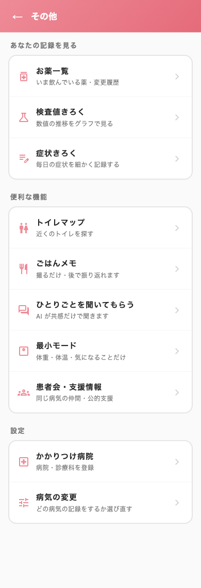

---

### 7.1 治療タイムライン

**これまでの治療の歴史を「年表」として残せます。**

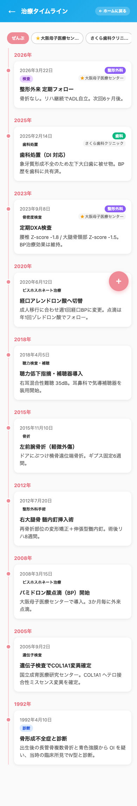

#### こんなことを記録できます

| カテゴリ | 記録できる内容の例 |
|----------|-------------------|
| 骨折 | 日時・部位・原因・治療内容 |
| 整形外科手術 | 手術名・入院期間 |
| ビスホスホネート治療 | 開始日・薬の変更 |
| 骨密度検査（DXA） | 検査日・結果 |
| 遺伝子検査 | 検査日・結果（COL1A1など） |
| 聴力検査・補聴 | 検査日・補聴器の使用開始 |
| 入院 | 期間・理由 |

#### こんな時に使います

- **新しい病院を受診するとき**：「いつ骨折した？」「どんな手術をした？」をゼロから説明しなくてよくなります
- **セカンドオピニオン・救急のとき**：自分の治療の全体像をすぐ見せられます
- **自分の記録を振り返りたいとき**：骨折の頻度が最近変わったかどうかを確認できます

> **OIの方に特に大切な機能です。** 骨折・手術・入院の記録は時間が経つと忘れがちです。新鮮なうちに少しずつ入力しておくことをおすすめします。

---

### 7.2 おくすり管理

**今飲んでいるお薬と、これまでの薬の変更履歴をまとめられます。**

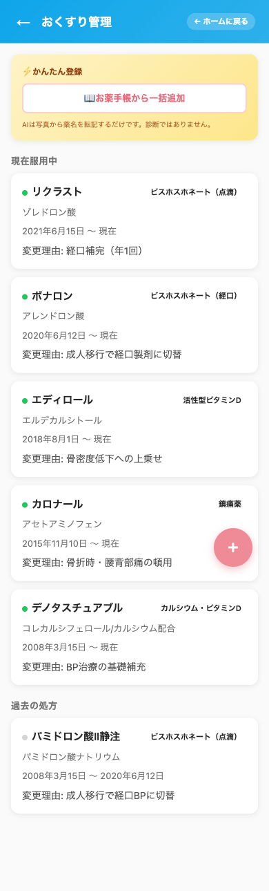

#### 記録できること

- 薬の名前（骨形成不全症に使われる薬のリストから選べます）
- いつから飲み始めたか
- 薬が変わった理由（副作用・効果不十分など）
- 飲み方（食前・食後など）
- メモ（気になることを自由に書ける）

#### OI によく使われる薬の例（アプリに登録済み）

- ビスホスホネート系（ゾレドロン酸・アレンドロン酸・リセドロン酸）
- カルシウム・ビタミンD サプリメント
- デノスマブ
- ロモソズマブ　など

> **ポイント：** 「なぜ薬が変わったのか」も記録しておくと、後から見返したときに役立ちます。

---

### 7.3 症状きろく（くわしい記録）

**毎日の体の状態を数値や○×でかんたんに記録できます。**

| カレンダー表示 | 入力画面 |
|---|---|
| 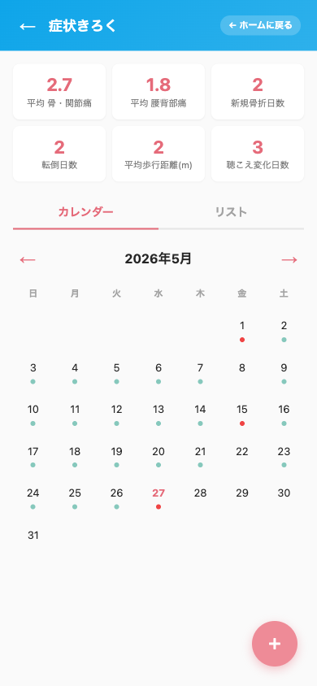 | 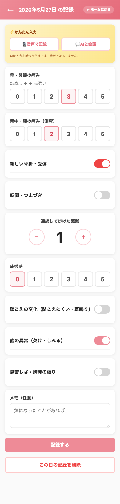 |

#### 記録できること（OI専用）

| 項目 | 記録の方法 |
|------|-----------|
| 骨・関節の痛み | 0〜5 の数字で記録 |
| 背中・腰の痛み（側弯） | 0〜5 の数字で記録 |
| 新しい骨折・受傷 | あり／なし |
| 転倒・つまづき | あり／なし |
| 連続して歩けた距離 | 数字で入力（メートル） |
| 疲労感 | 0〜5 の数字で記録 |
| 聴こえの変化 | あり／なし |
| 歯の異常 | あり／なし |
| 息苦しさ | あり／なし |

#### こんな時に役立ちます

- 痛みが増えてきた時期を後から確認できる
- 転倒が増えた → リハビリの先生に相談する目安になる
- 聴こえの変化に気づいたとき → 耳鼻科への相談タイミングがわかる

> **毎日書かなくて大丈夫です。** 「なんか今日しんどい」と感じた日だけ記録するだけでも十分です。

---

### 7.4 検査値きろく

**血液検査の数値・骨密度を記録してグラフで見られます。**

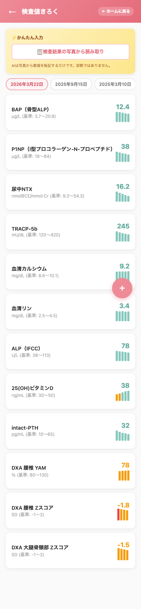

#### 記録できる検査値（OI専用）

| 検査名 | 何を見る？ |
|--------|-----------|
| BAP（骨型ALP） | 骨が作られているか（骨形成マーカー） |
| P1NP | 骨形成マーカー（Ⅰ型コラーゲン由来） |
| 尿中NTX・TRACP-5b | 骨が壊れていないか（骨吸収マーカー） |
| 血清カルシウム・リン | ミネラルバランス |
| 25(OH)ビタミンD | ビタミンD不足のチェック |
| DXA 腰椎・大腿骨（Zスコア） | 骨密度（年齢比） |

#### 使い方

1. 検査結果をもらったら数値を入力する
2. グラフで時間の流れと一緒に確認できる
3. 「みせる」画面から医師に見せることもできる

> **ビスホスホネート治療中の方へ：** BAP・P1NP の数値の変化をグラフで見ると、薬の効果が確認しやすくなります。

---

### 7.5 患者会・支援情報

**同じ病気の仲間と繋がる、制度を使うための情報をまとめてあります。**

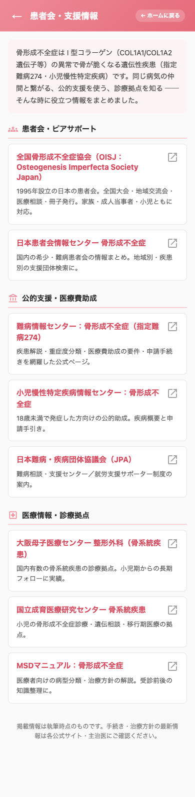

#### 載っている情報

| 種類 | 内容 |
|------|------|
| 患者会・ピアサポート | 全国骨形成不全症協会（OISJ）など |
| 医療費助成 | 指定難病274の助成制度・申請手続き |
| 小児慢性特定疾病 | 18歳未満の方向けの公的助成 |
| 診療拠点情報 | 大阪母子医療センター・国立成育医療研究センターなど |

---

## よくある質問

**Q. 毎日書かないといけませんか？**
必要ありません。病院に行った日・骨折した日・薬が変わった日など、「残しておきたい」と思ったときだけ書けば大丈夫です。

**Q. データはどこに保存されますか？**
LINE アカウントと連携した本番環境では、クラウド（Google Cloud）に安全に保存されます。

**Q. アプリを閉じてもデータは消えませんか？**
消えません。次に開いたときも同じ記録が表示されます。

**Q. 骨形成不全症以外の病気にも使えますか？**
はい。「その他 → 病気・設定を変える」から病気を変えると、その病気向けの画面に切り替わります。潰瘍性大腸炎・関節リウマチ・パーキンソン病など12疾患に対応しています。

---

*よりそい PHR — 株式会社メディキャンバス*
